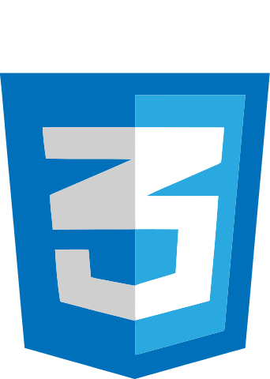
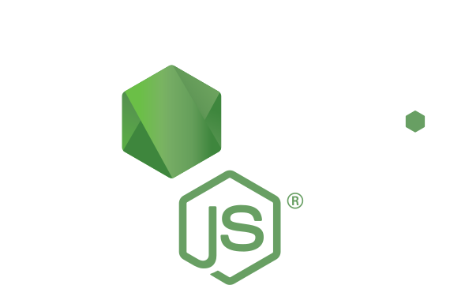
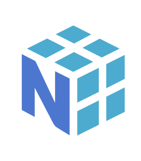

<h1 align="center">Hi, I'm Sara!</h1>   
<h2> 💻 About Me </h2>

I am a Data Engineer with nearly three years of professional expertise. During my college years, I engaged in coding as a side project. Upon graduating with a degree in Chemical Engineering, I intentionally pivoted to a career in technology while working in a non-IT role. This transition culminated in securing a position as a developer in a startup, where I have been actively contributing to various projects.
  
I have acquired a comprehensive understanding of Extract, Transform, Load (ETL) activities. ETL involves extracting data from diverse sources, transforming it to align with specific business requirements, and loading it into a target system for analysis or storage.
  
In my current role, I am responsible for both creating ETL pipelines and developing a CRUD web application. I contribute to the design of the application and ensure its seamless functionality. This involves enhancing the overall user experience by providing a user-friendly interface for creating, reading, updating, and deleting data.
  
Proficient in multiple programming languages, I am comfortable working with Python, SQL, JavaScript, and Ruby. Additionally, my skill set extends to various technologies, including Amazon Web Services (AWS), Airflow, Git, Docker, Metabase, and Power BI. This diverse expertise enables me to effectively address various facets of development and deliver robust solutions.

 
<h2>⚡ Languages, Frameworks and Tools </h2>

  <!-- Programming Languages -->
  
  
    
  <!-- Web Frameworks and tools -->
  
  
  
  
  
  
  
  
  
    
  <!-- Data Engineering -->
  
  
  
  
    
  <!-- Data Analysis -->
  
  
  
  
  

 
<h2> 📈 Dashboard </h2>

<h2> 💬 Contact-me! </h2>

  &nbsp;
  &nbsp;
  

